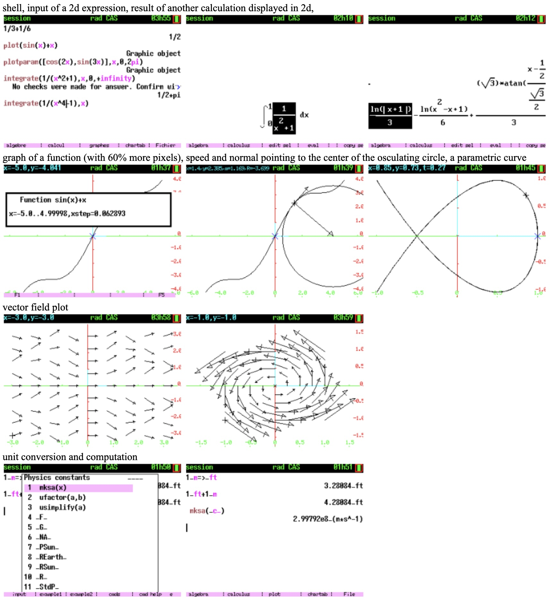

# KhiCAS CE

**An XCAS port for the TI-84 Plus CE / TI-83 Premium CE calculators.**

## Compilation:

### Prerequisites

Get the nightly CE toolchain https://github.com/CE-Programming/toolchain/releases/nightly  
(See docs: https://ce-programming.github.io/toolchain/)

### KhiCAS build

`./mkappen` or `./mkappfr`
will create in bin a lot of 8xv variables and an installer (8xp)  
(`make -j V=1 app install_prog`) and copy to shared/ti/app.  
(`cp bin/App**x* shared/ti/app`, `mkdir -p shared/ti/app`, `cp bin/App**x* shared/ti/app`)  

`bundle83` or `bundle84` will bundle these 8xv files and the installer.

## Installation on a hardware calculator:
See [install_en.txt](install_en.txt) or [install_fr.txt](install_fr.txt).

## Build customization:
Some compile flags control inclusion of parts of the code.

Without any flag: total size about 2260KB.
* math:
  * `-DWITH_LAPLACE`  Laplace/inverse Laplace transform about 20K
  * `-DWITH_DESOLVE`  desolve command about 60K (including Laplace)
* science:
  * `-DWITH_PERIODIC` periodic table about 10K
  * `-DWITH_UNITS` physical units about 40K

Note that 2 apps do never share a flash page, as a consequence you can
add space up to a multiple of 65.536, e.g. 2260 KB and 2280 KB will
leave free the same amount of flash.
